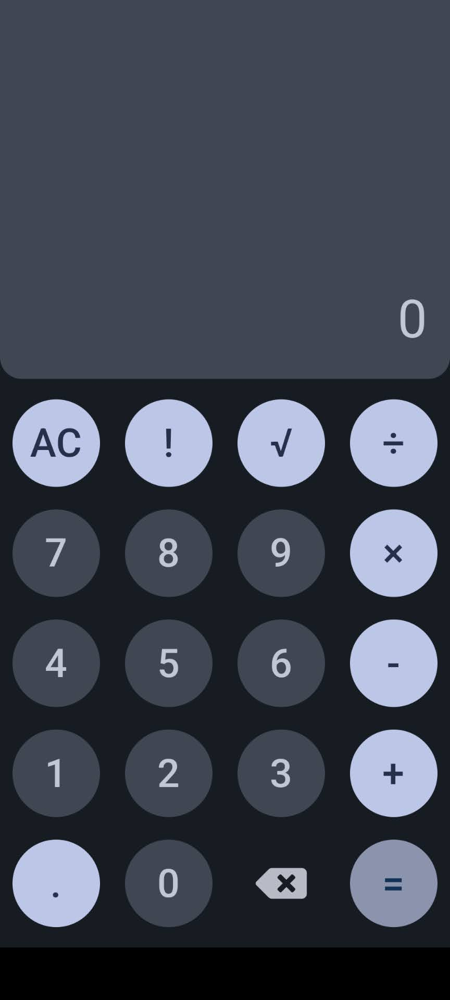
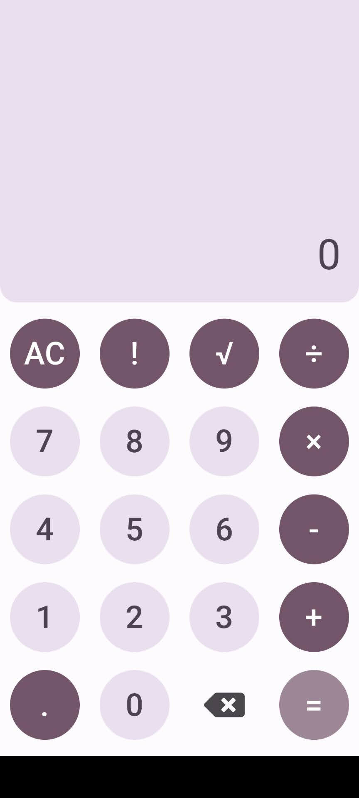
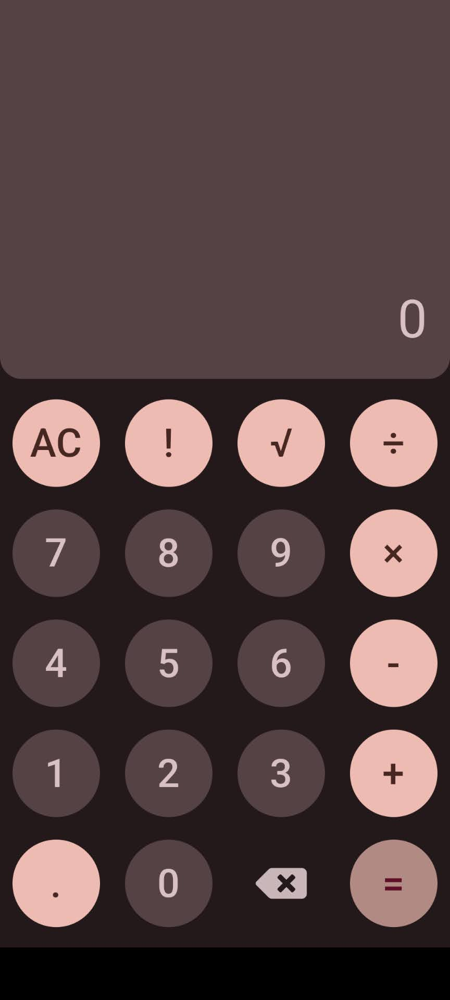

# Simple Calculator 🧮

A straightforward and user-friendly calculator built using Flutter. This project showcases the implementation of basic arithmetic operations and provides a clean and intuitive user interface.

### Material 3 Dynamic Color in Android 🎨
With  Android 12 and Material You, [`android dynamic_color`](https://pub.dev/packages/dynamic_color) has emerged as a significant theme enhancement. This feature allows the Android system to extract prominent colors from the user's wallpaper, generating a custom color palette. This palette is then applied across the system UI, including the notification shade, lock screen, and system settings.

For Flutter developers, this presents an exciting opportunity:

1. **Consistency with System UI**: By adopting dynamic color, Flutter apps can align their appearance with the system UI, offering a seamless user experience.
2. **Personalization**: Users receive a unique and personalized app appearance based on their chosen wallpaper.
3. **Adaptive Design**: Dynamic color ensures that the app UI remains legible and aesthetically pleasing, regardless of the wallpaper's color scheme.

To leverage dynamic color in Flutter, developers can use the [`dynamic_color`](https://pub.dev/packages/dynamic_color) package (or a similar package) to adapt their app's theme based on the system's dynamic color palette.

### Features 🌟

- Basic arithmetic operations: addition, subtraction, multiplication, and division.
- Clear and reset functions.
- Elegant user interface with Material You dynamic color integration.

 

## Screenshots

  
  
  

